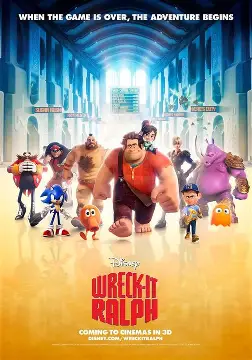

# 欢迎大家参加2025年Robocup2d招新考核！ 
我们首先发布任务一如下，正确提交任务一视为成功报名。

后续考核任务的发布也会在这里，随考核流程推进更新。

# 时间安排
---

任务一  11.19——11.26下午6点

......

---

# 任务一

---

1. 访问 GitHub 仓库 [链接](https://github.com/huoyubairisheng340/robocup2d-.git)， 并执行 **fork** 操作，将仓库克隆至本地环境。  
2. 在本地环境中，找到并编辑 `readme.md` 文档，添加任意一部影视作品内容及海报图片。编辑时请注重文档的结构性和美观性。  
3. 编辑完成后，将文档重命名为“学号+姓名+name.md”的格式，其中 **name** 为所选作品名称。 
4. 将修改后的文档提交至您的本地 Git 仓库，并推送至远程 GitHub 仓库。  

---

⚠️ **注意**：在整个过程中，请避免删除或修改其他参与者的作业。任何违反此规定的行为都将被视为严重违规，可能导致本次考核成绩被记为 **0 分**。

# 任务一tips
---

感兴趣的同学可以通过以下小游戏学习git
git闯关式学习，learn git branching：https://learngitbranching.js.org/?locale=zh_CN

---

# 温馨提示

---

报名同学需提前完成以下工具准备，这是参与后续考核的前提
 
1.成功安装Linux系统（Ubuntu 22.04版本），会使用终端执行基础命令，了解CMake

2.掌握GitHub基础操作

3.2d是开源项目，善用搜索引擎

4.C++基础代码阅读能力

---

# 《无敌破坏王》电影介绍  

## 剧情简介

《无敌破坏王》是一部由迪士尼制作的动画电影，于2012年上映。这部电影讲述了一个发生在电子游戏世界中的故事。主角拉尔夫是一个坏人角色，他厌倦了自己在游戏《修复它·费利克斯》中扮演的反派角色。拉尔夫渴望得到认可和尊重，因此他踏上了寻找自我价值的旅程。

## 角色介绍

### 拉尔夫

拉尔夫是游戏《修复它·费利克斯》中的反派角色。他的职责是破坏建筑物，而玩家则需要控制费利克斯来修复这些建筑物。尽管拉尔夫在游戏中扮演坏人，但他内心深处渴望被接受和尊重。

### 费利克斯

费利克斯是游戏《修复它·费利克斯》中的英雄角色，拥有修复一切的能力。他是拉尔夫的对立面，但最终成为了拉尔夫的朋友。

## 游戏世界

电影中展现了多个不同的游戏世界，包括《修复它·费利克斯》、《英雄使命》和《甜蜜冲刺》。每个世界都有其独特的风格和规则，展示了丰富多彩的游戏文化。

## 主题与意义

《无敌破坏王》不仅是一部娱乐性极强的动画电影，还探讨了关于自我认同、友情和成长的主题。通过拉尔夫的冒险旅程，观众可以看到一个角色如何克服内心的困惑，找到真正的自我价值。

## 结语

《无敌破坏王》以其独特的视角和精彩的故事赢得了观众的喜爱。它不仅仅是一部关于电子游戏的电影，更是一次心灵的旅程，让观众在欢笑中思考人生的意义。
